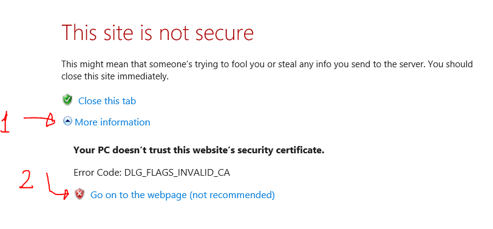

# Contributing

There are several ways in which you can contribute to the project:

1. **Log bugs or file feature suggestions**. To do this, simply file the bugs/suggestions in the Issues tab on GitHub for this project.
2. **Code samples**. To suggest edits to existing samples, or to suggest your own, please submit a pull request against the Samples repo: **<https://github.com/OfficeDev/office-js-snippets>**.
3. **Bug-fix/feature contributions**. If you have features or bug fixes that you'd like to see incorporated into Script Lab, just send us your pull request!

# Running Script Lab React from source

## Prereq:

- Download & Install Visual Studio Code. <https://code.visualstudio.com/>.
- Install the recommended VS extensions (which you should be prompted for when you open the repo).
- Download & install Node (version v10+). <https://nodejs.org/en>.

Note: the installation of Node JS add paths to your operating system's PATH variable. Therefore, in some cases you may log off and log in from your System to get Node JS and npm run to work within Visual Studio Code.

## Build steps:

From the root of the repo:

1. `npm install` **Be sure to run this after every pull/merge!**
2. `npm run start`

Your default browser will launch almost immediately. However, note that **it will take some 30-60 seconds before the website is actually up and running.**

Also, on first launch, the browsers will be stuck on the "Loading" page -- you will need to press ctrl+R to reload and show the actual editor/runner.

Also note that you'll see a few warnings in the node console. You can safely ignore them.

```
Compiled with warnings.

.../script-lab-react/node_modules/prettier/standalone.js
Critical dependency: the request of a dependency is an expression

.../script-lab-react/node_modules/typescript/lib/typescript.js
Critical dependency: the request of a dependency is an expression

.../script-lab-react/node_modules/source-map-support/source-map-support.js
Module not found: Can't resolve 'module' in '...\script-lab-react\node_modules\source-map-support'
```

When running locally, the Runner console might also show the following errors:

```
.../script-lab-react/node_modules/typescript/lib/typescript.js
Critical dependency: the request of a dependency is an expression

.../script-lab-react/node_modules/source-map-support/source-map-support.js
Module not found: Can't resolve 'module' in ...\script-lab-react\script-lab-react\node_modules\source-map-support'

Warning: Cannot update during an existing state transition (such as within `render`). Render methods should be a pure function of props and state.
```

You can safely ignore these -- those won't show up to users on the production site.

## Bypassing localhost HTTPS security issues

For testing in the web browser (whether standalone or in Office Online) in Chrome, you can bypass the "insecure localhost" by enabling this setting: <chrome://flags/#allow-insecure-localhost>

For testing on a PC version of Office, you _could_ trust the certificates from within Internet Explorer. However, new certs get generated every time that you run `npm run start`, so trusting them over and over again is tedious. If you're only interested in making changes to code that runs inside the taskpanes (which is what you will be doing 99% of the time for any Editor/Runner changes, unless you're debugging something to do with "functions.html" and the other ribbon buttons), you can just click through the "This site is not secure" warning and choose "Go on to the website (not recommended)" option.

.

If you _do_ need to trust the certificates, see below for a step-by-step animation. But be aware that you'll keep having to repeat these steps... The sites you'd need to trust are <https://localhost:3000> (editor) and <https://localhost:3200> (runner).

.

## Bypassing localhost HTTPS security issues 2

The method above might not work on current Edge browsers, you can have a try on the following way:

.
1. click the "Not secure" assert and export the insecure certificate from localhost
2. install the certificate downloaded on your station
3. restart your local station and refresh the localhost web
4. If still doesn't work, please have a try again. Not that the duration for this installed certificate is one month.

## Testing inside of an add-in

The **easiest** option is to install the **Store** version of the add-in (get it from <https://aka.ms/getscriptlab>). Then, using the dropdown on bottom left when in the Settings mode, switch to alpha -- and **from alpha, to localhost**. Note that the localhost option will only show up if you're in alpha (or already on localhost). The steps are akin to what's [described in the README](README.md#2017) for switching to Script Lab 2017, except choosing "Alpha" and then "localhost:3000" instead.

Note that just like described in the section above, you will need to bypass the HTTPS security warning for localhost.

**Alternatively**, you can also sideload the localhost manifest directly (though for that option, you might be forced to trust and re-trust the certificates!). The manifest is located at 'manifests/script-lab-react-localhost.xml', and instructions for sideloading can be found at <https://aka.ms/sideload-addins>.

## [Optional] Testing GitHub auth locally (on localhost)

1. Run `npm run generate:github` and follow the instructions there.
2. If your local website is already running, you will need to re-start it (re-`npm run start`)

# Manual-testing scenarios

Please see "[TESTING.md](TESTING.md)".

# Dev tips & tricks:

- `packages/common`:
  - When adding code to the `packages/common`, run `npm run build:package --workspace=common` in order to get Intellisense and the compiler to pick it up -- or just have `npm run start` already running and watching. In VS Code, you may need to `F12` into the file references before Intellisense is able to see the updated contents.
  - If typescript is failing to build with errors about missing values in common, you may be in a stale state. Try running `npm run clean` then `npm install` to force rebuild the common package.
- `packages/server`:
  - To debug server code, navigate to `chrome://inspect/` and choose your server node process from there. Note that if your code changes and `nodemon` reloads the server, you will need to close the Inspector tool and re-open again from the link above.
