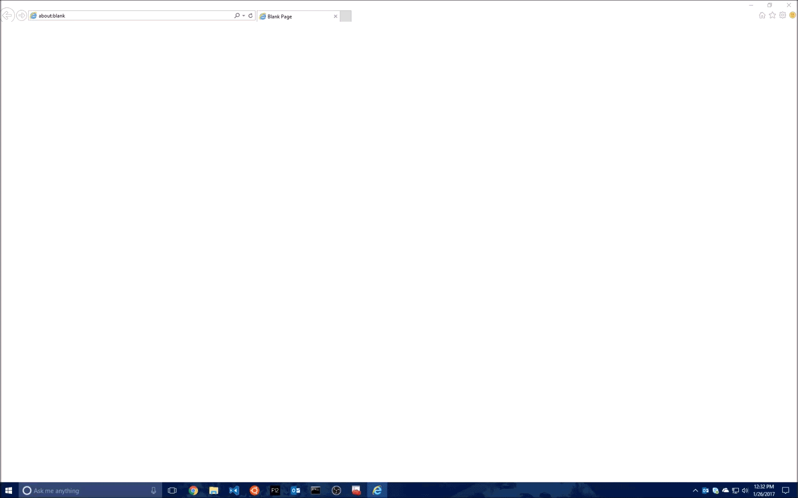
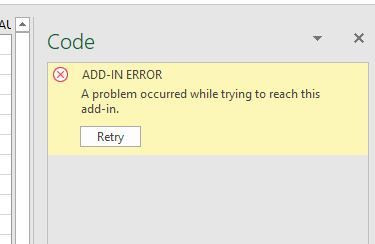

# Contributing

There are several ways in which you can contribute to the project:

1. **Log bugs or file feature suggestions**. To do this, simply file the bugs/suggestions in the Issues tab on GitHub for this project.
2. **Code samples**. To suggest edits to existing samples, or to suggest your own, please submit a pull request against the Samples repo: **<https://github.com/OfficeDev/office-js-snippets>**.
3. **Bug-fix/feature contributions**. If you have features or bug fixes that you'd like to see incorporated into Script Lab, just send us your pull request!

# Running Script Lab React from source

## Prereq:

- Download & Install Visual Studio Code. <https://code.visualstudio.com/>.
- Install the recommended VS extensions (which you should be prompted for when you open the repo).
- Download & install Node (version v10+). <https://nodejs.org/en>.
- Download & install Yarn, for use as an alternative for `npm install`. Download from <https://yarnpkg.com/en/docs/install> (or bootstrap Yarn installation by running once `npm install -g yarn`). The documentation also describes why Yarn is preferable to `npm install`.

Note: the installation of Node JS and Yarn add paths to your operating system's PATH variable. Therefore, in some cases you may log off and log in from your System to get Node JS and Yarn work withing Visual Studio Code.

## Build steps:

From the root of the repo:

1. `yarn install` (or just `yarn`). **Be sure to run this after every pull/merge!**
2. `yarn start`

Your default browser will launch almost immediately. However, note that **it will take some 30-60 seconds before the website is actually up and running.**

Also, on first launch, the browsers will be stuck on the "Loading" page -- you will need to press ctrl+R to reload and show the actual editor/runner.

Also note that you'll see a few warnings in the node console. You can safely ignore them.

```
Compiled with warnings.

.../script-lab-react/node_modules/prettier/standalone.js
Critical dependency: the request of a dependency is an expression

.../script-lab-react/node_modules/typescript/lib/typescript.js
Critical dependency: the request of a dependency is an expression

.../script-lab-react/node_modules/source-map-support/source-map-support.js
Module not found: Can't resolve 'module' in '...\script-lab-react\node_modules\source-map-support'
```

When running locally, the Runner console might also show the following errors:

```
.../script-lab-react/node_modules/typescript/lib/typescript.js
Critical dependency: the request of a dependency is an expression

.../script-lab-react/node_modules/source-map-support/source-map-support.js
Module not found: Can't resolve 'module' in ...\script-lab-react\script-lab-react\node_modules\source-map-support'

Warning: Cannot update during an existing state transition (such as within `render`). Render methods should be a pure function of props and state.
```

You can safely ignore these -- those won't show up to users on the production site.

## Trust the certificates

You will need to trust the certificates for each of <https://localhost:3000> (editor), <https://localhost:3200> (runner), and <http://localhost:5000> (server).

For testing in the web browser (whether standalone or in Office Online) in Chrome, you can bypass the "insecure localhost" by enabling this setting: <chrome://flags/#allow-insecure-localhost>

For testing on a PC version of Office, you will need to trust the certificates from within Internet Explorer. See the gif below for a step-by-step animation:

.

This is a particularly critical step for loading the Add-in inside of Office on a PC. If you fail to trust the certificates, you might see the following error:

.

## Testing inside of an add-in

1. Locate the add-in manifest (which you'll find in the `manifests` folder in the root of the repo). For purposes of running against localhost, use `localhost.xml`.

2. Sideload the manifest into your office host application. Use **either** option:
   - Sideload the localhost manifest located in 'manifests/script-lab-react-localhost.xml', using the instructions on <https://aka.ms/sideload-addins>.
   - Alternatively, install the **Store** version of the add-in, then switch environments (via dropdown on bottom left when in Settings mode) to alpha -- and **from alpha, to localhost**. Note that the localhost option will only show up if you're in alpha (or already on localhost). Also note that you need to be careful, it will stay stuck on _localhost_ until you undo it -- so if your local server isn't running, Script Lab might appear to be broken for you!

## [Optional] Testing GitHub auth locally (on localhost)

1. Run `yarn generate:github` and follow the instructions there.
2. If your local website is already running, you will need to re-start it (re-`yarn start`)

# Manual-testing scenarios

Please see "[TESTING.md](TESTING.md)".

# Dev tips & tricks:

- `packages/common`:
  - When adding code to the `packages/common`, run `yarn workspace common build:package` in order to get Intellisense and the compiler to pick it up -- or just have `yarn start` already running and watching. In VS Code, you may need to `F12` into the file references before Intellisense is able to see the updated contents.
- `packages/server`:
  - To debug server code, navigate to `chrome://inspect/` and choose your server node process from there. Note that if your code changes and `nodemon` reloads the server, you will need to close the Inspector tool and re-open again from the link above.
