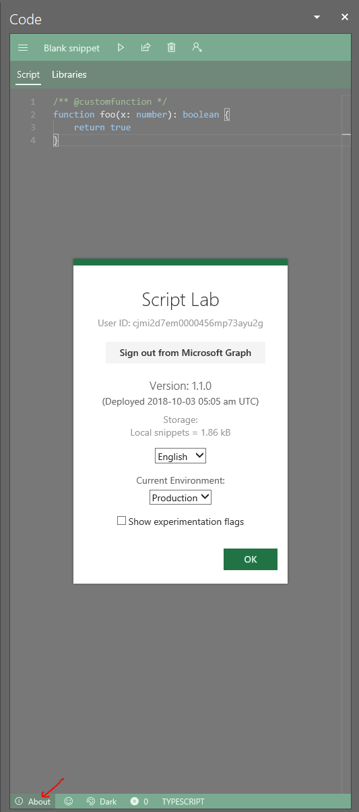
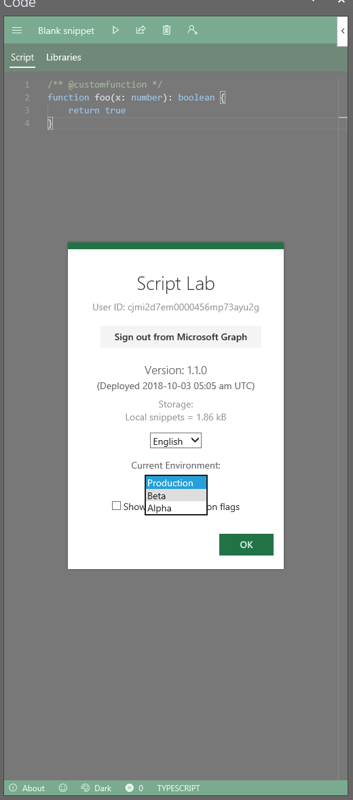
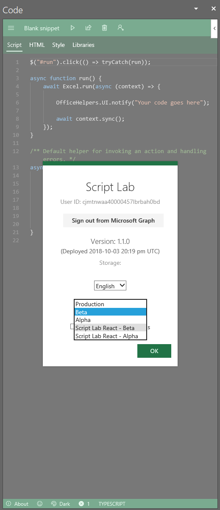
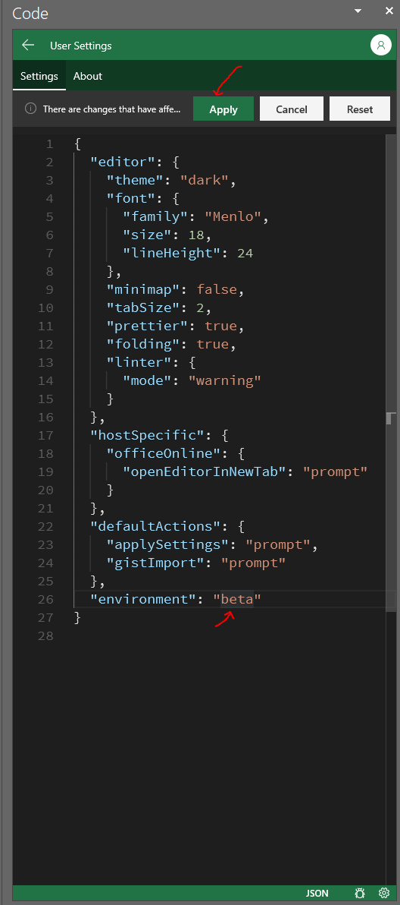

# Dogfooding Instructions

## Step 1 - Open Script Lab's About Page

You can do this by clicking opening the code editor and clicking the about button in the bottom left corner.

## Step 2 - Switch to Script Lab's Beta Environment

## Step 3 - Open the About Page of Script Lab Beta

After opening the page, select the 'Script Lab React - Beta' option.

## Step 4 - Start Dogfooding!

## Step 5 - Switching Back

To switch back, you need to open the settings page of the editor.

This can be done by clicking the small settings icon in the bottom right, or by pressing `Ctrl` + `,` in the editor.

Once in the settings view, change environment to `beta` and press apply at the top.

---

# Getting Access to the Repo

In order to get access to the repo, which is needed in order submit issues, you must follow the following steps:

1. If you haven't already, create a personal GitHub account and link it to Microsoft via https://repos.opensource.microsoft.com/
2. Join the OfficeDev team: https://repos.opensource.microsoft.com/officedev/join
3. Additionally, join https://github.com/orgs/OfficeDev/teams/everyone/members and click the request to join​ button
