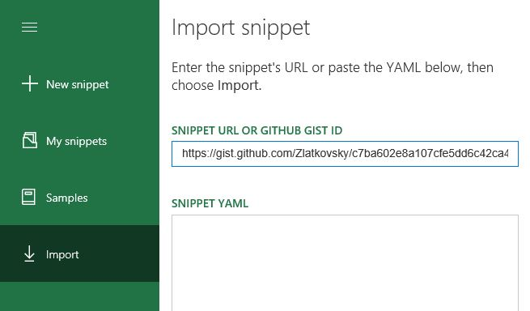

# Script Lab, a Microsoft Garage project

Experiment with the Office JavaScript API without leaving Excel, Outlook, Word, or PowerPoint!

> [!IMPORTANT]
> This repo has been archived because the codebase has moved to a Microsoft-internal source. However, the Script Lab tool is still available.

**Get [Script Lab](https://appsource.microsoft.com/product/office/WA104380862) in Excel, Word, and PowerPoint, or [Script Lab for Outlook](https://appsource.microsoft.com/product/office/WA200001603), free from Microsoft AppSource**.

[Read the blog post](https://devblogs.microsoft.com/microsoft365dev/update-on-the-future-of-the-script-lab-office-add-in/) on the future of Script Lab.

## Topics

- [What is Script Lab?](#what-is-script-lab)
- [Get Started](#get-started)
- [Import someone else's snippet, or export your own](#import-someone-elses-snippet-or-export-your-own)
- [Report a bug, or suggest a feature](#report-a-bug-or-suggest-a-feature)
- [Stay up-to-date](#stay-up-to-date)
- [Contribute to Script Lab](#contribute-to-script-lab)
- [Rate and review](#rate-and-review)
- [Articles & FAQs](#articles--faqs)
- [External media coverage](#external-media-coverage)
- [Code of Conduct](#code-of-conduct)

## What is Script Lab?

Wouldn't it be crazy if you could launch Excel, click to open a small code window, and then instantly start writing and executing JavaScript that interacts with your spreadsheet?

Script lab is a tool for anyone who wants to learn about writing Office Add-ins for Excel, Outlook, Word, or PowerPoint. The focus is the Office JavaScript API, which is the technology you need for building Office Add-ins that run across platforms. Maybe you're an experienced Office developer and you want to quickly prototype a feature for your add-in. Or maybe you've never tried writing code for Office and you just want to play with a sample and tweak it to learn more. Either way, Script Lab is for you.

Script Lab has three main features:

- **Code** in a pane beside your spreadsheet.
    - IntelliSense is there while you type so you can easily discover and use the Office JavaScript objects and methods. Script Lab uses the Monaco editor, the same tech that powers VS Code, so it's beautiful and lightweight.
    - Samples are pre-installed with Script Lab, so you don't have to start from scratch
    - Your can use any TypeScript features like arrow functions, template strings, and async/await (i.e., a good chunk of ES6 and ES7 features). But it's not only script: your snippets can also use HTML, CSS, and references to external libraries and data on the web.
- **Run** the code in another pane beside the editor.
    - Execution can include logic, API calls to Office, UI in the pane, and even output to a console.
    - Every time you make a code change you can refresh the editor and run the new version in seconds.
- **Share** your snippets.
    - If you create a snippet you'd like to share, you can copy it to your clipboard, save it as a GitHub gist. Then send the gist link to someone else to use on their computer.
    - The Import feature lets you load other people's snippets.

Script Lab works in Office 2013 or later on Windows, Office on the web, or Office on Mac.

You can get [Script Lab](https://appsource.microsoft.com/product/office/WA104380862) right now for free from Microsoft AppSource! It works for Excel, Word, and PowerPoint.

If you're interested in developing for Outlook, you can get [Script Lab for Outlook](https://appsource.microsoft.com/product/office/WA200001603), also free from AppSource.

Script Lab is a Microsoft Garage project that began at a hackathon. You can read the story of the original Script Lab creation on the [Garage website](https://www.microsoft.com/garage/profiles/script-lab/).

Here's a 1-minute teaser video:

## Get Started

[Explore Office JavaScript API using Script Lab](https://learn.microsoft.com/en-us/office/dev/add-ins/overview/explore-with-script-lab)

This 10-minute demo explains how to use the main features:

## Import someone else's snippet, or export your own

Script Lab is built around sharing. If someone gives you a URL to a GitHub Gist, simply open Script Lab, use the hamburger menu at the top left to see the menu, and choose "Import" category (either on the left or top, depending on the available screen space). Then, enter the URL of the Gist, and click the "Import" button at the bottom of the screen. In just these few clicks, you will be able to view and run someone else's snippet!

Conversely, to share _your_ snippet with someone, choose the "Copy to clipboard" button with the open snippet. You can share as a public [GitHub Gist](https://help.github.com/articles/about-gists/), or you can paste the snippet from the clipboard, and share it from there.

### Size restrictions

Script Lab is designed for you to play with small code samples. Generally, a snippet should be at most a few hundred lines and a few thousand characters.

Your snippet can use hard-coded data. A small amount of data (say, a few hundred characters) is OK to hard code in Script Lab. However, for larger pieces of data, we recommend that you store those externally then load them at runtime with a command like `fetch`.

Keep your snippets and hard-coded data small since storing several large snippets could exceed Script Lab's storage and cause issues when loading Script Lab.

## Report a bug, or suggest a feature

To report a bug, [create a new issue](https://github.com/OfficeDev/script-lab/issues/new). Please provide as much detail as you can, tell us: the operating system, the Office build number, and your browser (if you're using Office on the web).

If you have a suggestion for a feature, please feel free to file it under "issues" as well, and we will tag it appropriately. The more detail, the better! (see more at [CONTRIBUTING.md](CONTRIBUTING.md)).

If you have a **question**, please ask it on [Stack Overflow](https://stackoverflow.com/questions/tagged/office-js) and tag your questions with `office-js` and `scriptlab`.

## Stay up-to-date

- Follow [@OfficeDev](https://twitter.com/OfficeDev) on Twitter
- Follow [Script Lab](https://medium.com/script-lab) articles on [medium.com](https://medium.com/script-lab)
- Join our Office Developer program at [developer.microsoft.com](https://developer.microsoft.com/microsoft-365/dev-program)

## Contribute to Script Lab

There are a bunch of ways you can contribute to Script Lab:

- File bugs & suggestions (see [Report a bug, or suggest a feature](#report-a-bug-or-suggest-a-feature)).
- Contribute new samples, or improve existing one. Please submit a pull request to the [office-js-snippets repo](https://github.com/OfficeDev/office-js-snippets/pulls); more info in the [README](https://github.com/OfficeDev/office-js-snippets/blob/master/README.md) of that repo.
- Spread the word! Whether through writing a blog post ([examples](#external-media-coverage)), recording a video, tweeting about us, or sharing snippets with colleagues or the [StackOverflow](https://stackoverflow.com/questions/tagged/office-js) community -- we want more of the world to use Script Lab!
- Help improve the documentation. If you feel like this README or the [CONTRIBUTING.md doc](CONTRIBUTING.md) could use more details, please send a pull request!

## Rate and review

Leave a star-rating and (optionally) a review blurb for Script Lab on the [Office Store review page](https://store.office.com/writereview.aspx?assetid=WA104380862).

We'd prefer you [report issues on GitHub](https://github.com/OfficeDev/script-lab/issues/new).

## Articles & FAQs

- Announcing Script Lab React (January 1, 2019): [Official blog post](https://developer.microsoft.com/office/blogs/announcing-script-lab-react/)
- Script Lab overview: ["You can write JavaScript in Excel!"](https://medium.com/script-lab/you-can-write-javascript-in-excel-4ba588a948bd)
- Project history & the technology behind it: [Episode 127 on the Office 365 Developer Podcast](https://www.microsoft.com/microsoft-365/blog/2017/04/20/episode-127-new-script-lab-office-add-michael-zlatkovsky-bhargav-krishna-office-365-developer-podcast/)

## External media coverage

- August 29, 2017: ["Start Developing in OfficeJS Today with Script Lab"](http://theofficecontext.com/2017/08/29/start-developing-in-officejs-today-with-script-lab/) _by David Craig at theofficecontext.com_
- July 30, 2017: _[German]_ ["Eigene Script Lab Scripte in Office Online testen"](http://www.excel-ticker.de/eigene-script-lab-scripte-in-office-online-testen/). (Auto-translation: ["Test your own Script Lab scripts in Office Online"](http://www.microsofttranslator.com/bv.aspx?from=&to=en&a=http%3A%2F%2Fwww.excel-ticker.de%2Feigene-script-lab-scripte-in-office-online-testen%2F)) _by [Mourad Louha](https://twitter.com/maninweb)_
- June 14, 2017: _[Portuguese]_ ["Script Lab: Novo add-in da Microsoft"](https://medium.com/leonardo-xavier/script-lab-novo-add-in-da-microsoft-f8aee5bf0dd2). (Auto-translation: ["Script Lab: New Microsoft add-in"](https://translate.google.com/translate?sl=auto&tl=en&js=y&prev=_t&hl=en&ie=UTF-8&u=https%3A%2F%2Fmedium.com%2Fleonardo-xavier%2Fscript-lab-novo-add-in-da-microsoft-f8aee5bf0dd2&edit-text=&act=url)), by _[Leonardo Xavier](https://medium.com/leonardo-xavier)_.
- May 1, 2017: _[German]_ ["Prototyping von Microsoft Office JavaScript Add-Ins mit Script Lab"](http://www.excel-ticker.de/prototyping-von-microsoft-office-javascript-add-ins-mit-script-lab/). (Auto-translation: ["Prototyping Microsoft Office JavaScript add-ins with Script Lab"](http://www.microsofttranslator.com/bv.aspx?&lo=TP&from=de&to=en&a=http%3A%2F%2Fwww.excel-ticker.de%2Fprototyping-von-microsoft-office-javascript-add-ins-mit-script-lab%2F)), _by [Mourad Louha](https://twitter.com/maninweb)_
- May 1, 2017: _[Portuguese]_ ["Microsoft lança o Script Lab"](http://mlf.net.br/blog/microsoft-lanca-o-script-labs/). (Auto-translation: ["Microsoft Launches Script Lab"](http://www.microsofttranslator.com/bv.aspx?from=pt&to=en&a=http%3A%2F%2Fmlf.net.br%2Fblog%2Fmicrosoft-lanca-o-script-labs%2F)), _by Felipe Costa Gualberto_.
- April 18, 2017: ["Microsoft Garage Releases Script Lab"](https://winbuzzer.com/2017/04/18/microsoft-garage-releases-script-lab-tool-test-javascript-apis-inside-office-suite-xcxwbn/) _by Ryan Maskell at winbuzzer.com_

## Code of conduct

This project has adopted the [Microsoft Open Source Code of Conduct](https://opensource.microsoft.com/codeofconduct/). For more information, see the [Code of Conduct FAQ](https://opensource.microsoft.com/codeofconduct/faq/) or contact [opencode@microsoft.com](mailto:opencode@microsoft.com) with any additional questions or comments.
