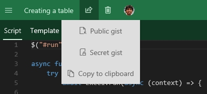
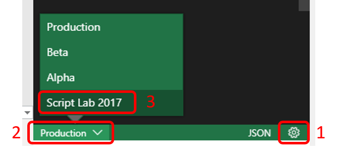

# Script Lab, a Microsoft Garage project

Experiment with the Office JavaScript API without ever leaving Excel, Word, or PowerPoint! [**Get Script Lab for free, from the Office Store**](https://store.office.com/app.aspx?assetid=WA104380862).

> Note: Script Lab has been re-written from the ground up in 2018, on a brand-new technology stack, including React and Fabric React.  For the older version of Script Lab 2017, see more [below](README.md#2017).

## Topics

* [What is Script Lab?](README.md#what-is)
* [Get started](README.md/#get-started)
* [Import someone else's snippet, or export your own](README.md#import)
* [Report a bug, or suggest a feature](README.md#report-bug)
* [Script Lab vs "Script Lab 2017"](README.md#2017)
* [Use Script Lab with older Office versions (Office 2013)](README.md/#office-2013)
* [Stay up-to-date](README.md/#up-to-date)
* [Rate and review](README.md#rate-and-review)
* [Contribute to Script Lab](README.md#contribute)
* [Articles & FAQs](README.md/#articles)
* [External blog posts & media coverage](README.md/#external-posts)

## What is Script Lab?

Wouldn't it be crazy if you could launch Excel, click to open a small code window, and then instantly start writing and executing JavaScript that interacts with your spreadsheet?

Script lab is a tool for anyone who wants to learn about writing Office add-ins for Excel, Word, or PowerPoint. The focus is the Office JavaScript API, which is the technology you need for building Office Add-ins that run across platforms. Maybe you're an experienced Office developer and you want to quickly prototype a feature for your add-in. Or maybe you've never tried writing code for Office and you just want to play with a sample and tweak it to learn more. Either way, Script Lab is for you.
Script Lab has three main features:

* **Code** in a pane beside your spreadsheet. IntelliSense is there while you type so you can easily discover and use the Office JavaScript objects and methods. And if you don't want to start from scratch there are plenty of samples pre-installed with Script Lab. Your snippets can use any TypeScript features like arrow functions, template strings, and async/await (i.e., a good chunk of ES6 and ES7 features). But it's not only script: your snippets can also use HTML, CSS, and references to external libraries and data on the web. Script Lab uses the Monaco editor, the same tech that powers VS Code, so it's beautiful and lightweight.
* **Run** the code in another pane beside the editor. Execution can include logic, API calls to Office, UI in the pane, and even output to a console. Every time you make a code change you can refresh the editor and run the new version in seconds.
* **Share** your snippets through GitHub. If you create a snippet you'd like to share, you can use Script Lab to save it. Then send the link to someone else to try it and tweak it on their computer. The Import feature lets you load other people's snippets.

You can [install Script Lab right now for free from the Office Store](https://store.office.com/app.aspx?assetid=WA104380862)! It works for Excel, Word, PowerPoint, and Project. You'll need Office 2013 or later, Office Online, or Office for Mac.

Script Lab is a Microsoft Garage project that began at a hackathon. You can read the story of the original Script Lab creation on the [Garage website](https://www.microsoft.com/garage/profiles/script-lab/).

Here's a 1-minute teaser video to give you a taste:

## Get Started

The easiest way to try Script Lab is with the Tutorial file for Excel that walks you through the tool in a few steps. You can get it here: [script-lab-tutorial.xlsx](https://script-lab.azureedge.net/assets/documents/script-lab-tutorial.xlsx)

Alternatively, you can start from scratch and [install Script Lab from the Store](https://store.office.com/app.aspx?assetid=WA104380862).

This 10-minute demo explains how to use the main features:

## Import someone else's snippet, or export your own

Script Lab is built around sharing. If someone gives you a URL to a GitHub GIST, simply open Script Lab, use the hamburger menu at the top left to see the menu, and choose "Import" category (either on the left or top, depending on the available screen space). Then, enter the URL of the GIST, and click the "Import" button at the bottom of the screen. In just these few clicks, you will be able to view and run someone else's snippet!

Conversely, to share _your_ snippet with someone, choose the "Share" menu within a particular snippet. You can share as a public or private [GitHub Gist](https://help.github.com/articles/about-gists/), or you can copy the entire snippet metadata to the clipboard, and share it from there.

## Report a bug, or suggest a feature

To report a bug, [create a new issue](https://github.com/OfficeDev/script-lab/issues/new). Please provide as much detail as you can: tell us the operating system, the Office build number, and your browser (if you're using Office Online).

If you have a suggestion for a feature, please feel free to file it under "issues" as well, and we will tag it appropriately. The more detail, the better! We also gladly accept pull requests... (see more at [CONTRIBUTING.md](CONTRIBUTING.md)).

Finally, if you have a **question**, please ask it on <https://stackoverflow.com> instead. Tag your questions with `office-js` and `scriptlab`.

## Script Lab vs. "Script Lab 2017"

Script Lab was re-written from scratch in 2018. Though its visual design remains similar to the 2017 version, its technology stack was overhauled to make us of React and Fabric React.  Among the improvements are keyboard accessibility, a much faster runner, and user-configurable settings.

If you encounter issues or need one of the few features that haven't been ported over yet, you can -- for the time being -- switch to the 2017 version of Script Lab.  To do so:

1. Open the editor pane and select or create a snippet.
2. In the bottom right of the editor, click the cog icon to open the settings.
3. In a dropdown that will now appear on the left side of the footer, choose "Script Lab 2017" (instead of your current environment).

The original repo of the 2017 version, now in a mostly-archival state, can be found at <https://github.com/OfficeDev/script-lab-2017>.

## Use Script Lab with older Office versions (Office 2013)

Office 2013 has several limitations compared to more recent versions.

First, there are far fewer supported objects and methods in the JavaScript API for Office 2013. As a result, many snippets that work on later versions of Office will not run in Office 2013. In the **Samples** menu we have included certain samples specifically designed to use only capabilities that are available in Office 2013. Those samples are marked **(2013)** in the sample title.

Second, Office 2013 (and Office 2016 RTM, if you don't have an Office 365 subscription) does not support ribbon buttons for Script Lab. As a result, there's a different way to access the **Code** and **Run** functions:

* To **Code**, select the **INSERT** tab and choose **My Add-ins**, then insert Script Lab.
* To **Run** a snippet, click the small **Run** triangle icon at the top of the Script Lab code pane.

## Stay up-to-date

* Follow [@OfficeDev](https://twitter.com/OfficeDev) on Twitter
* Follow [Script Lab](https://medium.com/script-lab) articles on [medium.com](https://medium.com/script-lab)
* Join our Office Developer program at [dev.office.com](https://dev.office.com/)

## Contribute to Script Lab

There are a bunch of ways you can contribute to Script Lab:

* File bugs & suggestions (see more in "[Report a bug, or suggest a feature](README.md#report-bug)" above).
* Contribute new samples, or improve existing one. Please submit a pull request to the [office-js-snippets repo](https://github.com/OfficeDev/office-js-snippets); more info in the [README](https://github.com/OfficeDev/office-js-snippets/blob/master/README.md) of that repo.
* Spread the word! Whether through writing a blog post (README.md#external-posts), recording a video, tweeting about us, or sharing snippets with colleagues or the [StackOverflow](https://stackoverflow.com/questions/tagged/office-js) community -- we want more of the world to use Script Lab!
* Help improve the documentation. If you feel like this README or the [CONTRIBUTING.md doc](CONTRIBUTING.md) could use more details, please send a pull request!

Finally, if you want to contribute code (bug fixes, features, localization, etc.), please see [CONTRIBUTING.md](CONTRIBUTING.md) to get you up and running with a local copy of Script Lab -- and then send us a pull request.

## Rate and review

Leave a star-rating and (optionally) a review blurb for Script Lab on the [Office Store review page](https://store.office.com/writereview.aspx?assetid=WA104380862).

Of course, we'd prefer that if you have issues you [report them on GitHub](https://github.com/OfficeDev/script-lab/issues/new) instead, but you're free to leave any review comments you wish.

## Articles & FAQs

* Script Lab overview: ["You can write JavaScript in Excel!"](https://medium.com/script-lab/you-can-write-javascript-in-excel-4ba588a948bd)
* Project history & the technology behind it: [Episode 127 on the Office 365 Developer Podcast](https://blogs.office.com/2017/04/20/episode-127-new-script-lab-office-add-michael-zlatkovsky-bhargav-krishna-office-365-developer-podcast/)

## External blog posts & media coverage

* August 29, 2017: ["Start Developing in OfficeJS Today with Script Lab"](http://theofficecontext.com/2017/08/29/start-developing-in-officejs-today-with-script-lab/) _by David Craig at theofficecontext.com_
* July 30, 2017: _[German]_ ["Eigene Script Lab Scripte in Office Online testen"](http://www.excel-ticker.de/eigene-script-lab-scripte-in-office-online-testen/). (Auto-translation: ["Test your own Script Lab scripts in Office Online"](http://www.microsofttranslator.com/bv.aspx?from=&to=en&a=http%3A%2F%2Fwww.excel-ticker.de%2Feigene-script-lab-scripte-in-office-online-testen%2F)) _by [Mourad Louha](https://twitter.com/maninweb)_
* June 14, 2017: _[Portuguese]_ ["Script Lab: Novo add-in da Microsoft"](https://medium.com/leonardo-xavier/script-lab-novo-add-in-da-microsoft-f8aee5bf0dd2). (Auto-translation: ["Script Lab: New Microsoft add-in"](https://translate.google.com/translate?sl=auto&tl=en&js=y&prev=_t&hl=en&ie=UTF-8&u=https%3A%2F%2Fmedium.com%2Fleonardo-xavier%2Fscript-lab-novo-add-in-da-microsoft-f8aee5bf0dd2&edit-text=&act=url)), by _[Leonardo Xavier](https://medium.com/leonardo-xavier)_.
* May 1, 2017: _[German]_ ["Prototyping von Microsoft Office JavaScript Add-Ins mit Script Lab"](http://www.excel-ticker.de/prototyping-von-microsoft-office-javascript-add-ins-mit-script-lab/). (Auto-translation: ["Prototyping Microsoft Office JavaScript add-ins with Script Lab"](http://www.microsofttranslator.com/bv.aspx?&lo=TP&from=de&to=en&a=http%3A%2F%2Fwww.excel-ticker.de%2Fprototyping-von-microsoft-office-javascript-add-ins-mit-script-lab%2F)), _by [Mourad Louha](https://twitter.com/maninweb)_
* May 1, 2017: _[Portuguese]_ ["Microsoft lança o Script Lab"](http://mlf.net.br/blog/microsoft-lanca-o-script-labs/). (Auto-translation: ["Microsoft Launches Script Lab"](http://www.microsofttranslator.com/bv.aspx?from=pt&to=en&a=http%3A%2F%2Fmlf.net.br%2Fblog%2Fmicrosoft-lanca-o-script-labs%2F)), _by Felipe Costa Gualberto_.
* April 18, 2017: ["Microsoft Garage Releases Script Lab"](https://winbuzzer.com/2017/04/18/microsoft-garage-releases-script-lab-tool-test-javascript-apis-inside-office-suite-xcxwbn/) _by Ryan Maskell at winbuzzer.com_

## Build Status

| Branch     | Status                                                                                                                                                     | Editor                                                                      | Runner                                                                                    | Server                                                                                         | Storybook                                                                                       |
| ---------- | ---------------------------------------------------------------------------------------------------------------------------------------------------------- | --------------------------------------------------------------------------- | ----------------------------------------------------------------------------------------- | ---------------------------------------------------------------------------------------------- | ----------------------------------------------------------------------------------------------- |
| master     |      | [script-lab-react-alpha](https://script-lab-react-alpha.azurewebsites.net/) | [script-lab-react-runner-alpha](https://script-lab-react-runner-alpha.azurewebsites.net/) | [script-lab-react-server-alpha](https://script-lab-react-server-alpha.azurewebsites.net/hello) | [script-lab-react-storybook-alpha](https://script-lab-react-storybook-alpha.azurewebsites.net/) |
| beta       |        | [script-lab-react-beta](https://script-lab-react-beta.azurewebsites.net/)   | [script-lab-react-runner-beta](https://script-lab-react-runner-beta.azurewebsites.net/)   | [script-lab-react-server-beta](https://script-lab-react-server-beta.azurewebsites.net/hello)   | [script-lab-react-storybook-beta](https://script-lab-react-storybook-beta.azurewebsites.net/)   |
| production |  | [script-lab-react](https://script-lab-react.azurewebsites.net/)             | [script-lab-react-runner](https://script-lab-react-runner.azurewebsites.net/)             | [script-lab-react-server](https://script-lab-react-server.azurewebsites.net/hello)             | [script-lab-react-storybook](https://script-lab-react-storybook.azurewebsites.net/)             |

This project has adopted the [Microsoft Open Source Code of Conduct](https://opensource.microsoft.com/codeofconduct/). For more information, see the [Code of Conduct FAQ](https://opensource.microsoft.com/codeofconduct/faq/) or contact [opencode@microsoft.com](mailto:opencode@microsoft.com) with any additional questions or comments.
